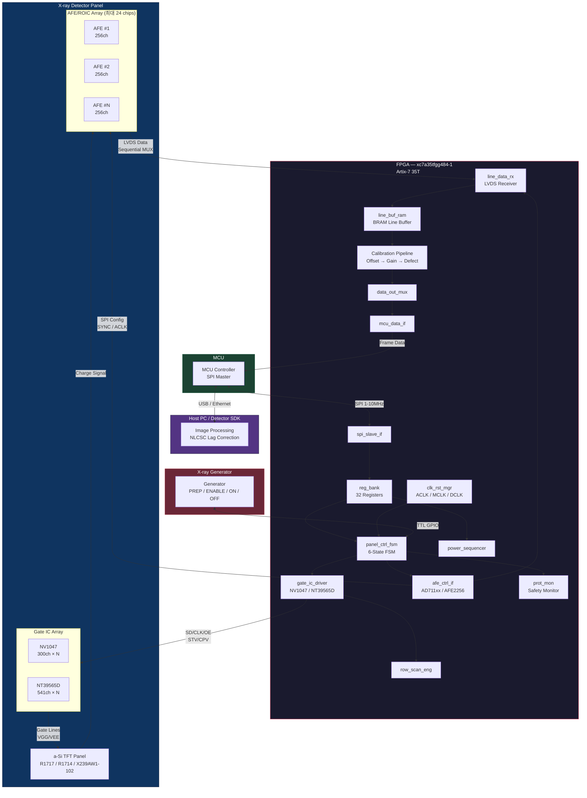
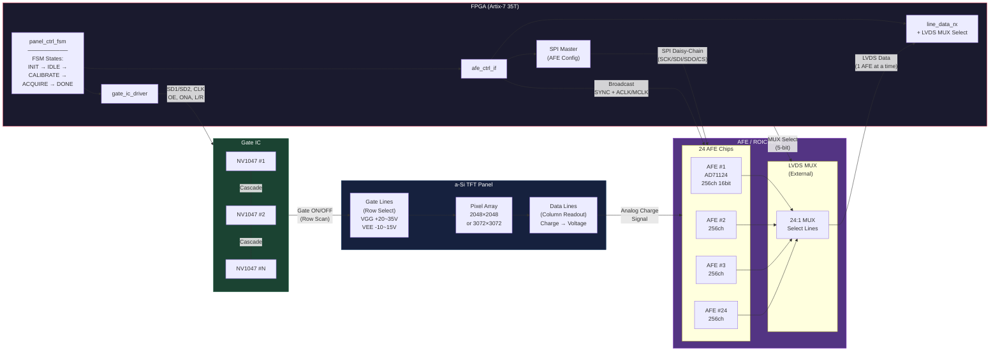
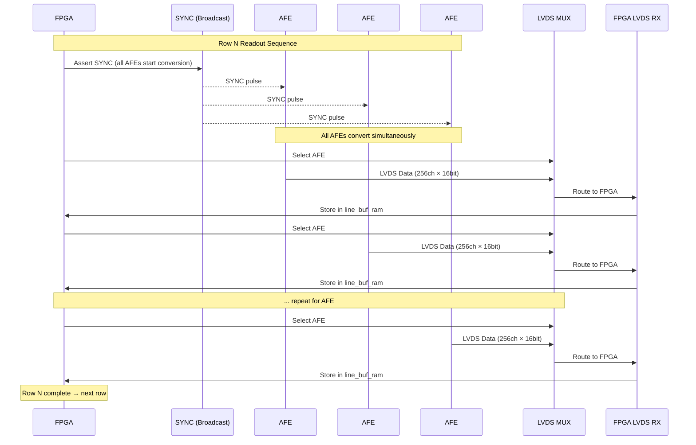

# panel-operation

FPGA-based X-ray Flat Panel Detector (FPD) Control System

a-Si TFT 기반 X-ray Flat Panel Detector의 FPGA 구동 제어 시스템.
3종의 패널, 2종의 Gate IC, 3종의 AFE/ROIC를 조합한 7가지 하드웨어 조합(C1-C7)을 통합 지원하며,
최대 24개 AFE 순차 리드아웃을 Artix-7 35T에서 구현합니다.

---

## System Architecture

### 전체 시스템 블록도



### Panel ↔ Gate IC ↔ ROIC ↔ FPGA 상세 구조도



### 24-AFE 순차 리드아웃 시퀀스



---

## Hardware Combinations

| ID | Panel | Gate IC | AFE/ROIC | 용도 |
|----|-------|---------|----------|------|
| C1 | R1717 (17×17") | NV1047 | AD71124 | 표준 정지상 |
| C2 | R1717 | NV1047 | AD71143 | 저전력 / 모바일 |
| C3 | R1717 | NV1047 | AFE2256 | 고화질 (저노이즈, CIC) |
| C4 | R1714 (17×14") | NV1047 | AD71124 | 비정방형 |
| C5 | R1714 | NV1047 | AFE2256 | 고화질 17×14 |
| C6 | X239AW1-102 (43×43cm) | NT39565D ×6 | AD71124 ×12 | 대형, 다중 AFE |
| C7 | X239AW1-102 | NT39565D ×6 | AFE2256 ×12 | 대형, 고화질 |

---

## Target Device

| Spec | Value |
|------|-------|
| FPGA | xc7a35tfgg484-1 |
| Family | Xilinx Artix-7 35T |
| Package | FGG484 |
| Speed Grade | -1 |
| Logic Cells | 33,280 |
| DSP48E1 | 90 |
| BRAM36K | 50 (1,800 Kb) |
| I/O Pins | 250 |
| MMCM | 5 |
| AFE 지원 | 최대 24 chips (순차 리드아웃) |
| Toolchain | Vivado 2025.2 |

---

## FPGA Module Hierarchy

```
fpga_top_cX.sv              (조합별 Top-Level, 핀 매핑)
├── spi_slave_if.sv          MCU SPI 슬레이브
├── clk_rst_mgr.sv           클럭 분배 (ACLK/MCLK) + 리셋 동기화
├── reg_bank.sv              32-레지스터 파일 (0x00-0x1F)
├── panel_ctrl_fsm.sv        메인 구동 FSM (6 states, 5 modes)
│   ├── gate_ic_driver       [NV1047 | NT39565D]
│   │   └── row_scan_eng.sv  행 스캔 카운터
│   ├── afe_ctrl_if          [AD711xx | AFE2256]
│   │   └── line_data_rx.sv  LVDS 수신 + MUX 선택
│   │       └── line_buf_ram.sv  BRAM 라인 버퍼
│   └── prot_mon.sv          과노출 보호
├── calibration_pipeline     오프셋 → 게인 → 결함 보정
├── power_sequencer.sv       전원 모드 M0-M5
├── emergency_shutdown.sv    비상 정지
├── data_out_mux.sv          데이터 출력 정렬
└── mcu_data_if.sv           MCU 데이터 전송
```

---

## FSM Operating Modes

| Value | Mode | Description |
|-------|------|-------------|
| 000 | STATIC | 단일 프레임 획득 |
| 001 | CONTINUOUS | 자동 반복 (형광투시) |
| 010 | TRIGGERED | X-ray 외부 트리거 대기 |
| 011 | DARK_FRAME | Gate off, AFE 리드아웃만 (캘리브레이션) |
| 100 | RESET_ONLY | 패널 리셋 전용 |

---

## Implementation Plan

13개 SPEC으로 분해한 10단계 구현 계획:

| SPEC | Phase | Title |
|------|-------|-------|
| SPEC-FPD-001 | 1 | SPI Slave + Register Bank + Clock Manager |
| SPEC-FPD-002 | 2 | Panel Control FSM (6-state, 5-mode) |
| SPEC-FPD-003 | 3A | Gate NV1047 Driver + Row Scan Engine |
| SPEC-FPD-004 | 3B | Gate NT39565D Driver (large panel) |
| SPEC-FPD-005 | 4A | AFE AD711xx Controller (ACLK/SYNC) |
| SPEC-FPD-006 | 4B | AFE2256 Controller (MCLK/CIC/SYNC) |
| SPEC-FPD-007 | 5 | LVDS Data Receiver + Line Buffer |
| SPEC-FPD-008 | 6 | Power Sequencer + Emergency Shutdown |
| SPEC-FPD-009 | 7 | Calibration Pipeline (Offset/Gain/Defect) |
| SPEC-FPD-010 | 8 | Forward Bias + LTI Lag Correction |
| SPEC-FPD-011 | 9 | Integration: fpga_top C1 (reference) |
| SPEC-FPD-012 | 9 | Integration: fpga_top C6 (24-AFE sequential) |
| SPEC-FPD-013 | 10 | Radiography Static Mode Extension |

상세 계획: [`.moai/project/implementation-plan.md`](.moai/project/implementation-plan.md)

---

## Documentation

| Directory | Content |
|-----------|---------|
| `docs/fpga-design/` | FPGA 설계 사양서 (모듈 아키텍처, 구동 알고리즘, 정지영상, 전원 설정) |
| `docs/research/` | 부품/알고리즘 리서치 (TFT 물리, Gate IC, AFE, 래그 보정, 캘리브레이션) |
| `docs/datasheet/` | IC 데이터시트 PDF (AD71124, AD71143, AFE2256, NV1047, NT39565D, 패널) |
| `.moai/project/` | 프로젝트 문서 (product.md, structure.md, tech.md, implementation-plan.md) |

---

## License

Private / Internal Use
