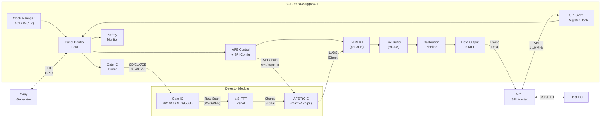
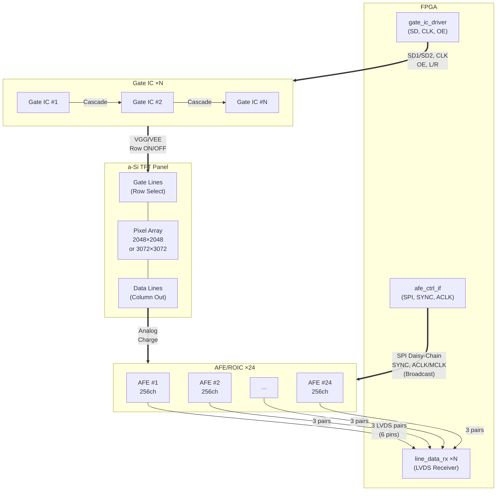
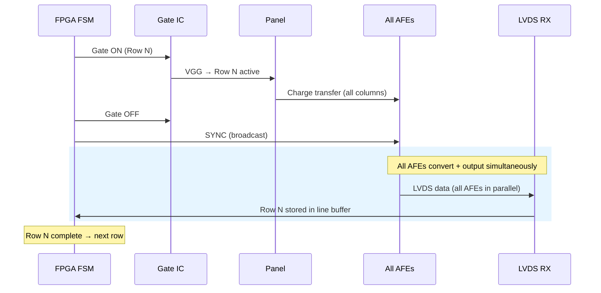

# panel-operation

FPGA-based X-ray Flat Panel Detector (FPD) Control System

a-Si TFT 기반 X-ray Flat Panel Detector의 FPGA 구동 제어 시스템.
3종의 패널, 2종의 Gate IC, 3종의 AFE/ROIC를 조합한 7가지 하드웨어 조합(C1-C7)을 통합 지원하며,
최대 24개 AFE를 Artix-7 35T에서 구현합니다.

---

## System Architecture

### 전체 시스템 블록도



### Panel - Gate IC - ROIC - FPGA 연결 구조



### 데이터 수집 시퀀스 (1 Row)



### 신호 흐름 요약

```
MCU ──SPI──▶ FPGA ──SD/CLK/OE──▶ Gate IC ──VGG/VEE──▶ Panel (Row Select)
                                                            │
                                                     Charge Signal
                                                            ▼
MCU ◀──Data── FPGA ◀──LVDS (3 pairs/AFE × 24 = 72 pairs)── AFE ◀── Panel (Column Out)
                │                      ▲
                │                      │
                └──SPI/SYNC/ACLK───────┘  (Broadcast to all AFEs)
```

---

## Hardware Combinations

| ID | Panel | Gate IC | AFE/ROIC | 용도 |
|----|-------|---------|----------|------|
| C1 | R1717 (17×17") | NV1047 | AD71124 | 표준 정지상 |
| C2 | R1717 | NV1047 | AD71143 | 저전력 / 모바일 |
| C3 | R1717 | NV1047 | AFE2256 | 고화질 (저노이즈, CIC) |
| C4 | R1714 (17×14") | NV1047 | AD71124 | 비정방형 |
| C5 | R1714 | NV1047 | AFE2256 | 고화질 17×14 |
| C6 | X239AW1-102 (43×43cm) | NT39565D ×6 | AD71124 ×12 | 대형, 다중 AFE |
| C7 | X239AW1-102 | NT39565D ×6 | AFE2256 ×12 | 대형, 고화질 |

---

## Target Device

| Spec | Value |
|------|-------|
| FPGA | xc7a35tfgg484-1 |
| Family | Xilinx Artix-7 35T |
| Package | FGG484 |
| Speed Grade | -1 |
| Logic Cells | 33,280 |
| DSP48E1 | 90 |
| BRAM36K | 50 (1,800 Kb) |
| I/O Pins | 250 |
| MMCM | 5 |
| AFE Support | Max 24 chips (direct LVDS, 3 pairs/AFE = 6 pins) |
| LVDS (24 AFE) | 72 diff pairs = 144 pins (of 250 available) |
| Toolchain | Vivado 2025.2 |

---

## FPGA Module Hierarchy

### v1 RTL Directory Structure (BRAM only)

```
rtl/
├── packages/                      Global definitions
│   ├── fpd_types_pkg.sv           FSM states, enums, type definitions
│   └── fpd_params_pkg.sv          Configurable system parameters
│
├── common/                        Shared FPGA infrastructure
│   ├── spi_slave_if.sv            MCU SPI slave (register R/W)
│   ├── clk_rst_mgr.sv            Clock generation (MMCM) + reset sync
│   ├── reg_bank.sv                32-register file (0x00-0x1F)
│   ├── data_out_mux.sv            Line data → MCU bus alignment
│   ├── mcu_data_if.sv             MCU data transfer + IRQ
│   ├── prot_mon.sv                Over-exposure timeout, error flags
│   ├── power_sequencer.sv         Power mode M0-M5, VGL-before-VGH
│   └── emergency_shutdown.sv      Over-voltage/temp/PLL detection
│
├── panel/                         Panel driving control
│   ├── panel_ctrl_fsm.sv          Main FSM (6 states, 5 modes)
│   ├── panel_reset_ctrl.sv        Reset sequence + dummy scans
│   └── panel_integ_ctrl.sv        Integration timing + X-ray handshake
│
├── gate/                          Gate IC drivers
│   ├── gate_nv1047.sv             NV1047 driver (C1-C5): SD/CLK/OE
│   ├── gate_nt39565d.sv           NT39565D driver (C6-C7): dual STV/CPV
│   └── row_scan_eng.sv            Row counter + Gate ON/OFF timing
│
├── roic/                          AFE/ROIC controllers
│   ├── afe_ad711xx.sv             AD71124/AD71143 (ACLK, SYNC, SPI)
│   ├── afe_afe2256.sv             AFE2256 (MCLK, CIC, TP_SEL)
│   ├── afe_spi_master.sv          SPI master (daisy-chain, max 24 AFE)
│   ├── line_data_rx.sv            LVDS receiver (per AFE, ISERDESE2)
│   └── line_buf_ram.sv            BRAM ping-pong line buffer
│
└── top/                           Top-level per combination
    └── fpga_top_c1.sv             C1: NV1047 + AD71124 (reference)
```

### v2 추가 Modules (외부 메모리 확장, 별도 구현)

```
rtl/
├── extmem/                        External memory interface
│   ├── ext_mem_if.sv              SRAM/DDR MIG interface
│   └── frame_buffer_ctrl.sv       Frame buffer management
│
└── calibration/                   Real-time correction pipeline
    ├── offset_subtractor.sv       Offset subtraction (ext mem)
    ├── gain_multiplier.sv         Gain normalization (ext mem)
    ├── defect_replacer.sv         Defect pixel interpolation
    ├── lag_corrector_lti.sv       LTI lag correction (ext mem state)
    └── forward_bias_ctrl.sv       Forward bias control
```

---

## FSM Operating Modes

| Value | Mode | Description |
|-------|------|-------------|
| 000 | STATIC | 단일 프레임 획득 |
| 001 | CONTINUOUS | 자동 반복 (형광투시) |
| 010 | TRIGGERED | X-ray 외부 트리거 대기 |
| 011 | DARK_FRAME | Gate off, AFE 리드아웃만 (캘리브레이션) |
| 100 | RESET_ONLY | 패널 리셋 전용 |

---

## Implementation Plan

### v1: BRAM Only (외부 메모리 없음)

핵심 구동 + 데이터 수집. 보정은 MCU/PC 소프트웨어에서 처리.

| SPEC | Phase | Title |
|------|-------|-------|
| SPEC-FPD-001 | 1 | SPI Slave + Register Bank + Clock Manager |
| SPEC-FPD-002 | 2 | Panel Control FSM (6-state, 5-mode) |
| SPEC-FPD-003 | 3 | Gate NV1047 Driver + Row Scan Engine |
| SPEC-FPD-004 | 3 | Gate NT39565D Driver (large panel) |
| SPEC-FPD-005 | 4 | AFE AD711xx Controller (ACLK/SYNC) |
| SPEC-FPD-006 | 4 | AFE2256 Controller (MCLK/CIC/SYNC) |
| SPEC-FPD-007 | 5 | LVDS Data Receiver + Line Buffer + MCU Output |
| SPEC-FPD-008 | 6 | Power Sequencer + Emergency Shutdown |
| SPEC-FPD-009 | 7 | Integration: fpga_top C1/C3/C6 |
| SPEC-FPD-010 | 8 | Radiography Static Mode Extension |

### v2: 외부 메모리 확장 (v1 완료 후)

외부 SRAM/DDR 추가, FPGA 내 실시간 보정 파이프라인 구현.

| SPEC | Title |
|------|-------|
| SPEC-FPD-011 | External Memory Interface (SRAM/DDR) |
| SPEC-FPD-012 | Offset Subtraction Pipeline |
| SPEC-FPD-013 | Gain Multiplication Pipeline |
| SPEC-FPD-014 | Defect Pixel Replacement |
| SPEC-FPD-015 | LTI Lag Correction |
| SPEC-FPD-016 | Forward Bias Control |
| SPEC-FPD-017 | Frame Buffer + Multi-frame Averaging |
| SPEC-FPD-018 | v2 Integration & Calibration Validation |

상세 계획: [`.moai/project/implementation-plan.md`](.moai/project/implementation-plan.md)

---

## Documentation

| Directory | Content |
|-----------|---------|
| `docs/fpga-design/` | FPGA 설계 사양서 (모듈 아키텍처, 구동 알고리즘, 정지영상, 전원 설정) |
| `docs/research/` | 부품/알고리즘 리서치 (TFT 물리, Gate IC, AFE, 래그 보정, 캘리브레이션) |
| `docs/datasheet/` | IC 데이터시트 PDF (AD71124, AD71143, AFE2256, NV1047, NT39565D, 패널) |
| `.moai/project/` | 프로젝트 문서 (product.md, structure.md, tech.md, implementation-plan.md) |

---

## License

Private / Internal Use
