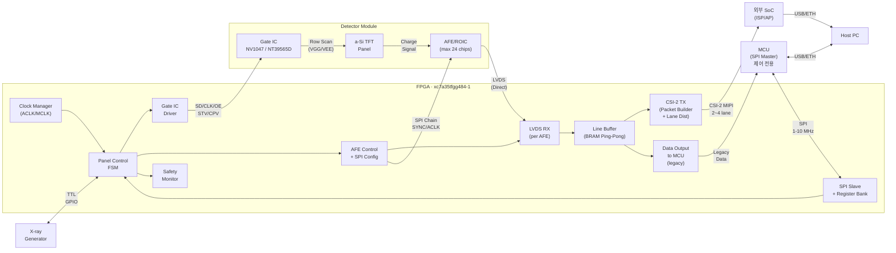
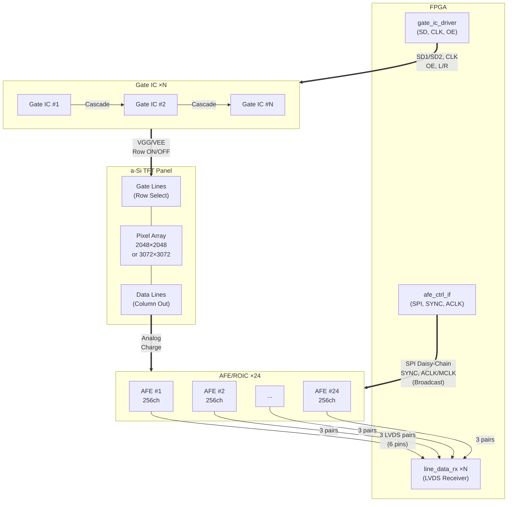
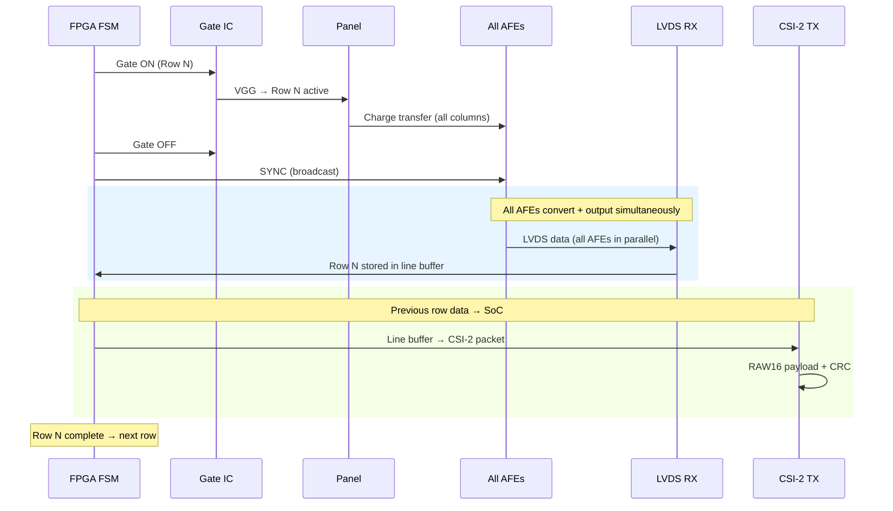
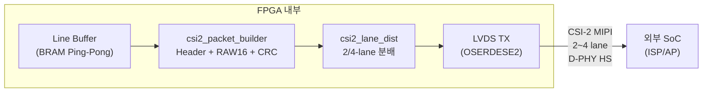
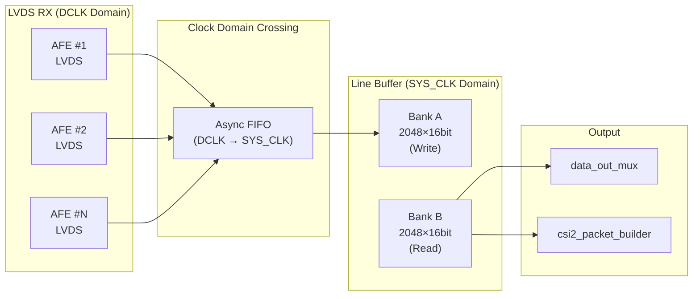
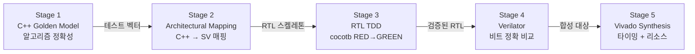

# panel-operation

FPGA-based X-ray Flat Panel Detector (FPD) Control System

a-Si TFT 기반 X-ray Flat Panel Detector의 FPGA 구동 제어 시스템.
3종의 패널, 2종의 Gate IC, 3종의 AFE/ROIC를 조합한 7가지 하드웨어 조합(C1-C7)을 통합 지원하며,
최대 24개 AFE를 Artix-7 35T에서 구현합니다.

**데이터 출력**: CSI-2 MIPI TX (2~4 lane)를 통해 외부 SoC로 고속 전송 (primary).
MCU는 제어/설정 전용 (legacy).

---

## System Architecture

### 전체 시스템 블록도



### Panel - Gate IC - ROIC - FPGA 연결 구조



### 데이터 수집 시퀀스 (1 Row)



---

## Data Output Architecture

### CSI-2 MIPI TX (Primary Output)

Artix-7 35T에서 CSI-2 MIPI TX D-PHY 소프트 구현은 **이미 검증 완료**되어 운용 중.
OSERDESE2 기반 직렬화 + LVDS TX로 D-PHY HS 모드를 구현하며, 외부 직렬화 IC가 불필요합니다.



#### 데이터 경로

| 단계 | 모듈 | 기능 |
|------|------|------|
| 1 | `line_buf_ram` | Ping-pong BRAM에서 완료된 라인 데이터 읽기 |
| 2 | `csi2_packet_builder` | CSI-2 패킷 조립: Short Packet (FS/FE) + Long Packet (Header + RAW16 Payload + CRC-16) |
| 3 | `csi2_lane_dist` | 바이트 인터리빙으로 2/4-lane 분배 (Lane 0 = byte[0,4,8...], Lane 1 = byte[1,5,9...]) |
| 4 | LVDS TX (OSERDESE2) | D-PHY HS 모드 직렬 전송 |

#### CSI-2 패킷 구조

- **Short Packet**: Frame Start (FS, DT=0x00), Frame End (FE, DT=0x01)
- **Long Packet**: Data Identifier (DI) + Word Count (WC) + ECC + RAW16 Payload + CRC-16
- **Data Type**: 0x2E (RAW16)
- **Virtual Channel**: 0 (단일 카메라)

#### 대역폭 구성

| 패널 | 해상도 | 프레임 크기 (16-bit) | 30fps 데이터율 | CSI-2 구성 |
|------|--------|---------------------|---------------|-----------|
| C1-C5 (17") | 2048x2048 | 8 MB | 240 MB/s | 2-lane @ 1.5 Gbps |
| C6-C7 (43cm) | 3072x3072 | 18.9 MB | 567 MB/s | 4-lane @ 1.5 Gbps |

### MCU Interface (Legacy)

MCU 인터페이스는 제어/설정 및 소량 데이터 전송 용도로 유지됩니다.

- `data_out_mux`: 다중 AFE 라인 데이터 → 순차 버스 정렬
- `mcu_data_if`: 16-bit 병렬 데이터 출력 + LINE_RDY IRQ

---

## Line Buffer Architecture

### Ping-Pong BRAM 구조

라인 버퍼는 LVDS RX (DCLK 도메인)에서 수신한 데이터를 SYS_CLK 도메인으로 전달하며,
CSI-2 TX와 MCU 출력 모두에 데이터를 공급합니다.



### 동작 원리

1. **Write Phase**: LVDS RX가 현재 행의 AFE 데이터를 Bank A에 순차 기록
2. **Read Phase**: 이전 행의 Bank B 데이터를 CSI-2 TX (primary) 및 MCU (legacy)로 전송
3. **Bank Swap**: 라인 완료 시 Bank A ↔ Bank B 자동 전환 (1 SYS_CLK 이내)

### Clock Domain Crossing

| 소스 | 대상 | 방식 |
|------|------|------|
| DCLK (AFE 내부 생성) | SYS_CLK (100 MHz) | Dual-clock BRAM 또는 Async FIFO |
| FIFO depth | ≥16 words per AFE group | Overflow 방지 |

### BRAM 사용량

| 용도 | BRAM36K | 비고 |
|------|---------|------|
| Line buffer (ping-pong) | 4 | 2048x16bit x 2 banks |
| LVDS async FIFO (CDC) | 2-4 | Per AFE group |
| **v1 합계** | **~6-8** | **50개 중 사용** |
| 잔여 (v2 확장용) | 42-44 | |

### 다중 AFE 데이터 정렬

`data_out_mux`가 N개 AFE의 256ch 데이터를 픽셀 순서로 재정렬:

- AFE #0: pixel[0..255], AFE #1: pixel[256..511], ..., AFE #N: pixel[(N-1)*256 .. N*256-1]
- C1-C5 (8 AFE): 2048 pixels/line
- C6-C7 (12 AFE): 3072 pixels/line

---

## SW-First Verification

**SPEC 문서**: [`.moai/specs/SPEC-FPD-SIM-001/`](.moai/specs/SPEC-FPD-SIM-001/) (35개 EARS 요구사항, 20개 수용기준, 6-Phase 구현 계획)

### 5단계 검증 파이프라인



### C++ → RTL 매핑 규칙

| C++ Construct | SystemVerilog | Notes |
|---------------|---------------|-------|
| `class Model` | `module` | 1:1 매핑 |
| `uint16_t member` | `logic [15:0] reg` | always_ff 레지스터 |
| `step() { if(rst)... }` | `always_ff @(posedge clk or posedge rst)` | 비동기 리셋 |
| `enum class State` | `typedef enum logic [N:0]` | FSM 상태 |
| `std::array<T,N>` (N>64) | `logic [W:0] mem [0:N-1]` | BRAM inferred |
| `std::queue<T>` | Async FIFO (dual-clock BRAM) | CDC FIFO |

### TDD 개발 사이클 (Testbench-First)

1. C++ 골든 모델 작성 (알고리즘 정확성 확인)
2. cocotb 테스트벤치 작성 (expected behavior 정의)
3. RTL 스켈레톤 작성 (인터페이스만)
4. cocotb 실행 → **FAIL (Red)**
5. RTL 구현
6. cocotb 실행 → **PASS (Green)**
7. RTL 리팩토링 (Green 유지)
8. Verilator로 C++ 골든 모델 vs RTL 비트 비교

### 도구 스택

| Tool | Role | License |
|------|------|---------|
| **C++17 (gcc/MSVC)** | 골든 모델: AFE 타이밍, Gate 시퀀스, FSM, CSI-2 TX | Free |
| **GoogleTest** | C++ 골든 모델 단위 테스트 | Open-source |
| **Verilator** | RTL → C++ 변환, DPI-C 사이클 정확 비교 (10~50x faster) | Open-source |
| **cocotb** | Python 테스트벤치, 파일 기반 테스트 벡터 (UVM 불필요) | Open-source |
| **Vivado xsim** | Xilinx 프리미티브 검증, 합성 후 시뮬레이션 | Free (Vivado) |
| **CMake >= 3.20** | 크로스 플랫폼 빌드 (Windows MSVC + Linux GCC) | Open-source |

### C++ Golden Model 클래스 계층

```
GoldenModelBase (추상 기반: reset/step/compare)
├── SpiSlaveModel          SPEC-001: SPI Mode 0/3, 32-register R/W
├── RegBankModel           SPEC-001: 32x16-bit register file
├── ClkRstModel            SPEC-001: MMCM 클럭 + 2-FF reset sync
├── PanelFsmModel          SPEC-002: 7-state FSM, 5 operating modes
├── GateNv1047Model        SPEC-003: SD1 shift register, OE/ONA
├── GateNt39565dModel      SPEC-004: Dual-STV, 6-chip cascade
├── AfeAd711xxModel        SPEC-005: AD71124/AD71143 (parameterized)
├── AfeAfe2256Model        SPEC-006: MCLK, CIC, pipeline mode
├── LvdsRxModel            SPEC-007: ADI/TI mode LVDS deserialization
├── LineBufModel           SPEC-007: Ping-pong BRAM + CDC queue
├── Csi2PacketModel        SPEC-007: FS/FE + RAW16 + CRC-16 + ECC
├── Csi2LaneDistModel      SPEC-007: 2/4-lane byte interleaving
├── ProtMonModel           SPEC-008: 5초 타임아웃, 과전압/과온도 감지
└── PowerSeqModel          SPEC-008: VGL→VGH 시퀀스, 8-state FSM
```

### Xilinx Primitive Handling (Verilator 호환)

Verilator는 Xilinx 프리미티브를 직접 지원하지 않으므로 behavioral wrapper를 사용:

| Module | Primitives | Verilator | xsim |
|--------|-----------|-----------|------|
| clk_rst_mgr | MMCME2_ADV | Behavioral (클럭 분주/체배) | 실제 MMCM |
| line_data_rx | IBUFDS, ISERDESE2, IDELAYE2 | Behavioral (DDR→8-bit) | 실제 프리미티브 |
| CSI-2 TX | OSERDESE2 | Behavioral (8-bit→DDR) | 실제 프리미티브 |

### sim/ 디렉토리 구조

```
sim/
├── golden_models/
│   ├── core/                        Base framework
│   │   ├── GoldenModelBase.h/cpp    Abstract base: reset/step/compare
│   │   ├── SignalTypes.h            Bit-accurate types (uint16_t, packed structs)
│   │   ├── ClockDomain.h/cpp        Multi-clock domain modeling
│   │   ├── TestVectorIO.h/cpp       Test vector read/write (hex/binary)
│   │   ├── CRC16.h/cpp              CRC-16 CCITT (MIPI CSI-2)
│   │   └── ECC.h/cpp                MIPI CSI-2 ECC calculator
│   ├── models/                      Per-module golden models (20 files)
│   │   ├── SpiSlaveModel.h/cpp      SPEC-001
│   │   ├── PanelFsmModel.h/cpp      SPEC-002
│   │   ├── GateNv1047Model.h/cpp    SPEC-003
│   │   ├── AfeAd711xxModel.h/cpp    SPEC-005
│   │   ├── Csi2PacketModel.h/cpp    SPEC-007
│   │   └── ...                      (14 models total)
│   ├── generators/                  Test vector generators
│   │   ├── gen_spi_vectors.cpp      SPEC-001
│   │   ├── gen_fsm_vectors.cpp      SPEC-002
│   │   ├── gen_csi2_vectors.cpp     SPEC-007
│   │   └── ...
│   └── test_vectors/                Generated output (hex/bin per SPEC)
├── cocotb_tests/                    Python testbenches (14 files)
│   ├── conftest.py                  Shared fixtures + vector loader
│   ├── test_spi_slave.py            SPEC-001
│   ├── test_panel_fsm.py            SPEC-002
│   ├── test_csi2_tx.py              SPEC-007
│   └── ...
├── verilator/                       Cycle-accurate RTL comparison
│   ├── sim_main.cpp                 Verilator top-level driver
│   ├── golden_compare.h/cpp         C++ model vs RTL comparator
│   ├── xilinx_behav/                Xilinx primitive behavioral wrappers
│   │   ├── MMCME2_ADV_behav.sv
│   │   ├── ISERDESE2_behav.sv
│   │   ├── IDELAYE2_behav.sv
│   │   ├── IBUFDS_behav.sv
│   │   └── OSERDESE2_behav.sv
│   └── Makefile
├── tests/                           C++ unit tests (GoogleTest)
│   ├── test_crc16.cpp
│   ├── test_ecc.cpp
│   ├── test_spi_model.cpp
│   └── ...
└── CMakeLists.txt                   Top-level build (golden_models + tests + generators)
```

### 예상 규모

| Category | Files | LOC |
|----------|-------|-----|
| Core framework | 10 | ~800 |
| Golden models | 40 | ~4,000 |
| Vector generators | 6 | ~600 |
| C++ unit tests | 6 | ~1,200 |
| cocotb tests | 14 | ~2,800 |
| Verilator + wrappers | 11 | ~1,000 |
| **Total** | **~87** | **~10,400** |

---

## Hardware Combinations

| ID | Panel | Gate IC | AFE/ROIC | 용도 | CSI-2 구성 |
|----|-------|---------|----------|------|-----------|
| C1 | R1717 (17x17") | NV1047 | AD71124 | 표준 정지상 | 2-lane |
| C2 | R1717 | NV1047 | AD71143 | 저전력 / 모바일 | 2-lane |
| C3 | R1717 | NV1047 | AFE2256 | 고화질 (저노이즈, CIC) | 2-lane |
| C4 | R1714 (17x14") | NV1047 | AD71124 | 비정방형 | 2-lane |
| C5 | R1714 | NV1047 | AFE2256 | 고화질 17x14 | 2-lane |
| C6 | X239AW1-102 (43x43cm) | NT39565D x6 | AD71124 x12 | 대형, 다중 AFE | 4-lane |
| C7 | X239AW1-102 | NT39565D x6 | AFE2256 x12 | 대형, 고화질 | 4-lane |

---

## Target Device

| Spec | Value |
|------|-------|
| FPGA | xc7a35tfgg484-1 |
| Family | Xilinx Artix-7 35T |
| Package | FGG484 |
| Speed Grade | -1 |
| Logic Cells | 33,280 |
| DSP48E1 | 90 |
| BRAM36K | 50 (1,800 Kb) |
| I/O Pins | 250 |
| MMCM | 5 |
| AFE Support | Max 24 chips (direct LVDS, 3 pairs/AFE = 6 pins) |
| LVDS (24 AFE) | 72 diff pairs = 144 pins (of 250 available) |
| CSI-2 TX | D-PHY soft-IP (OSERDESE2), 2~4 lane, 검증 완료 |
| Toolchain | Vivado 2025.2 |

---

## FPGA Module Hierarchy

### v1 RTL Directory Structure (BRAM only)

```
rtl/
├── packages/                      Global definitions
│   ├── fpd_types_pkg.sv           FSM states, enums, type definitions
│   └── fpd_params_pkg.sv          Configurable system parameters
│
├── common/                        Shared FPGA infrastructure
│   ├── spi_slave_if.sv            MCU SPI slave (register R/W)
│   ├── clk_rst_mgr.sv            Clock generation (MMCM) + reset sync
│   ├── reg_bank.sv                32-register file (0x00-0x1F)
│   ├── data_out_mux.sv            Line data → MCU bus alignment
│   ├── mcu_data_if.sv             MCU data transfer + IRQ (legacy)
│   ├── csi2_packet_builder.sv     CSI-2 packet assembly (FS/FE + RAW16 + CRC)
│   ├── csi2_lane_dist.sv          CSI-2 2/4-lane byte interleaving
│   ├── prot_mon.sv                Over-exposure timeout, error flags
│   ├── power_sequencer.sv         Power mode M0-M5, VGL-before-VGH
│   └── emergency_shutdown.sv      Over-voltage/temp/PLL detection
│
├── panel/                         Panel driving control
│   ├── panel_ctrl_fsm.sv          Main FSM (6 states, 5 modes)
│   ├── panel_reset_ctrl.sv        Reset sequence + dummy scans
│   └── panel_integ_ctrl.sv        Integration timing + X-ray handshake
│
├── gate/                          Gate IC drivers
│   ├── gate_nv1047.sv             NV1047 driver (C1-C5): SD/CLK/OE
│   ├── gate_nt39565d.sv           NT39565D driver (C6-C7): dual STV/CPV
│   └── row_scan_eng.sv            Row counter + Gate ON/OFF timing
│
├── roic/                          AFE/ROIC controllers
│   ├── afe_ad711xx.sv             AD71124/AD71143 (ACLK, SYNC, SPI)
│   ├── afe_afe2256.sv             AFE2256 (MCLK, CIC, TP_SEL)
│   ├── afe_spi_master.sv          SPI master (daisy-chain, max 24 AFE)
│   ├── line_data_rx.sv            LVDS receiver (per AFE, ISERDESE2)
│   └── line_buf_ram.sv            BRAM ping-pong line buffer
│
└── top/                           Top-level per combination
    └── fpga_top_c1.sv             C1: NV1047 + AD71124 (reference)
```

### sim/ Directory Structure (SW-First Verification)

sim/ 구조는 위의 SW-First Verification 섹션 참조. 상세 사양: [SPEC-FPD-SIM-001](.moai/specs/SPEC-FPD-SIM-001/plan.md)

### v2 추가 Modules (외부 메모리 확장, 별도 구현)

```
rtl/
├── extmem/                        External memory interface
│   ├── ext_mem_if.sv              SRAM/DDR MIG interface
│   └── frame_buffer_ctrl.sv       Frame buffer management
│
└── calibration/                   Real-time correction pipeline
    ├── offset_subtractor.sv       Offset subtraction (ext mem)
    ├── gain_multiplier.sv         Gain normalization (ext mem)
    ├── defect_replacer.sv         Defect pixel interpolation
    ├── lag_corrector_lti.sv       LTI lag correction (ext mem state)
    └── forward_bias_ctrl.sv       Forward bias control
```

---

## FSM Operating Modes

| Value | Mode | Description |
|-------|------|-------------|
| 000 | STATIC | 단일 프레임 획득 |
| 001 | CONTINUOUS | 자동 반복 (형광투시) |
| 010 | TRIGGERED | X-ray 외부 트리거 대기 |
| 011 | DARK_FRAME | Gate off, AFE 리드아웃만 (캘리브레이션) |
| 100 | RESET_ONLY | 패널 리셋 전용 |

---

## 신호 흐름 요약

```
MCU ──SPI──▶ FPGA ──SD/CLK/OE──▶ Gate IC ──VGG/VEE──▶ Panel (Row Select)
                                                            │
                                                     Charge Signal
                                                            ▼
                 FPGA ◀──LVDS (3 pairs/AFE × 24 = 72 pairs)── AFE ◀── Panel (Column Out)
                  │                       ▲
                  │                       │
                  └──SPI/SYNC/ACLK────────┘  (Broadcast to all AFEs)

                  │ Line Buffer (Ping-Pong BRAM)
                  │
           ┌──────┴──────────┐
           ▼                 ▼
  CSI-2 MIPI TX        data_out_mux
  (Primary)            (Legacy MCU)
           │                 │
           ▼                 ▼
  외부 SoC (ISP/AP)     MCU (제어 전용)
           │
    SW 보정 (Offset,
    Gain, Defect, Lag)
```

---

## Implementation Plan

### v1: BRAM Only (외부 메모리 없음)

핵심 구동 + 데이터 수집. 보정은 MCU/PC 소프트웨어에서 처리.
각 SPEC에 Acceptance Criteria, Module Mapping, Timing Constraints, Register Map, Test Plan, Dependencies 포함.

| SPEC | Title | Modules | Dependencies |
|------|-------|---------|--------------|
| SPEC-FPD-001 | Foundation: SPI + Register + Clock | spi_slave_if, reg_bank, clk_rst_mgr, packages | None |
| SPEC-FPD-002 | Panel Control FSM (7-state, 5-mode) | panel_ctrl_fsm, panel_reset_ctrl, panel_integ_ctrl | 001 |
| SPEC-FPD-003 | Gate NV1047 Driver + Row Scan Engine | gate_nv1047, row_scan_eng | 001 |
| SPEC-FPD-004 | Gate NT39565D Driver (large panel) | gate_nt39565d | 001, 003 |
| SPEC-FPD-005 | AFE AD711xx Controller (ACLK/SYNC) | afe_ad711xx, afe_spi_master | 001 |
| SPEC-FPD-006 | AFE2256 Controller (MCLK/CIC/SYNC) | afe_afe2256 | 001, 005 |
| SPEC-FPD-007 | LVDS Receiver + Line Buffer + CSI-2 TX Output | line_data_rx, line_buf_ram, data_out_mux, mcu_data_if, csi2_packet_builder, csi2_lane_dist | 005 or 006 |
| SPEC-FPD-008 | Safety: Protection + Emergency + Power | prot_mon, emergency_shutdown, power_sequencer | 001 |
| SPEC-FPD-009 | Integration: fpga_top C1/C3/C6 | fpga_top_c1, fpga_top_c3, fpga_top_c6 | 001-008 |
| SPEC-FPD-010 | Radiography Static Mode Extension | panel_ctrl_fsm (확장) | 009 |

| SPEC-FPD-SIM-001 | SW-First Verification Framework | GoldenModelBase, 14 C++ models, cocotb tests, Verilator harness | 각 SPEC 병렬 |

**Implementation Order**: SIM-001 (각 SPEC과 병행) + 001 → (002 + 008 병렬) → (003 + 005 병렬) → (004 + 006 병렬) → 007 → 009 → 010

### v2: 외부 메모리 확장 (v1 완료 후)

외부 SRAM/DDR 추가, FPGA 내 실시간 보정 파이프라인 구현.

| SPEC | Title |
|------|-------|
| SPEC-FPD-011 | External Memory Interface (SRAM/DDR) |
| SPEC-FPD-012 | Offset Subtraction Pipeline |
| SPEC-FPD-013 | Gain Multiplication Pipeline |
| SPEC-FPD-014 | Defect Pixel Replacement |
| SPEC-FPD-015 | LTI Lag Correction |
| SPEC-FPD-016 | Forward Bias Control |
| SPEC-FPD-017 | Frame Buffer + Multi-frame Averaging |
| SPEC-FPD-018 | v2 Integration & Calibration Validation |

상세 계획 (SPEC별 인수 기준, 타이밍, 테스트): [`.moai/project/implementation-plan.md`](.moai/project/implementation-plan.md)

---

## Documentation

| Directory | Content |
|-----------|---------|
| `docs/fpga-design/` | FPGA 설계 사양서 (모듈 아키텍처, 구동 알고리즘, 정지영상, 전원 설정) |
| `docs/research/` | 부품/알고리즘 리서치 (TFT 물리, Gate IC, AFE, 래그 보정, 캘리브레이션) |
| `docs/datasheet/` | IC 데이터시트 PDF (AD71124, AD71143, AFE2256, NV1047, NT39565D, 패널) |
| `.moai/project/` | 프로젝트 문서 (product.md, structure.md, tech.md, implementation-plan.md) |
| `sim/` | SW-First 검증 (C++ 골든 모델, cocotb 테스트, Verilator) |

---

## License

Private / Internal Use
