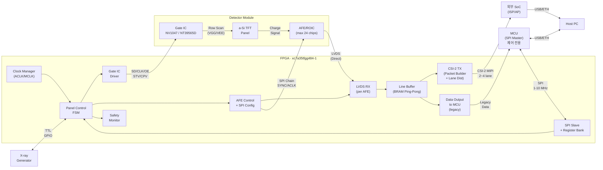
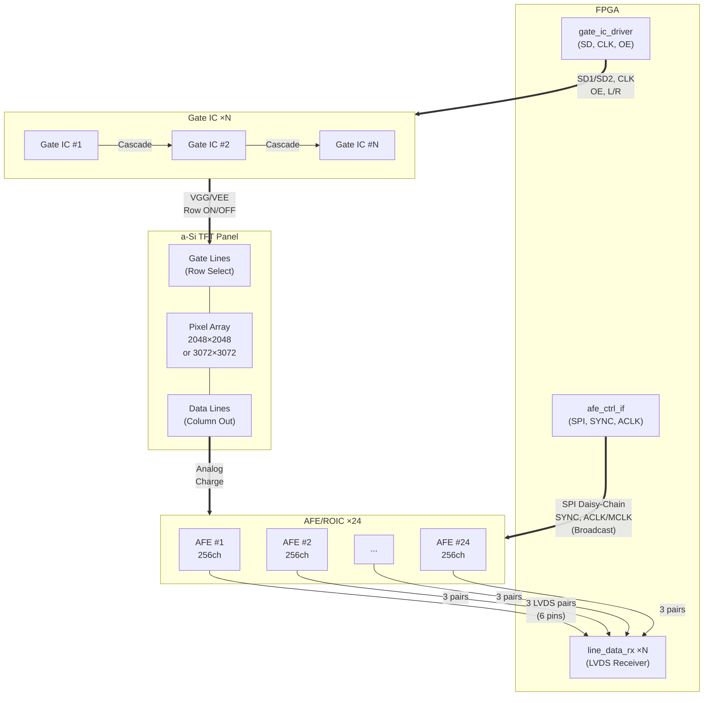
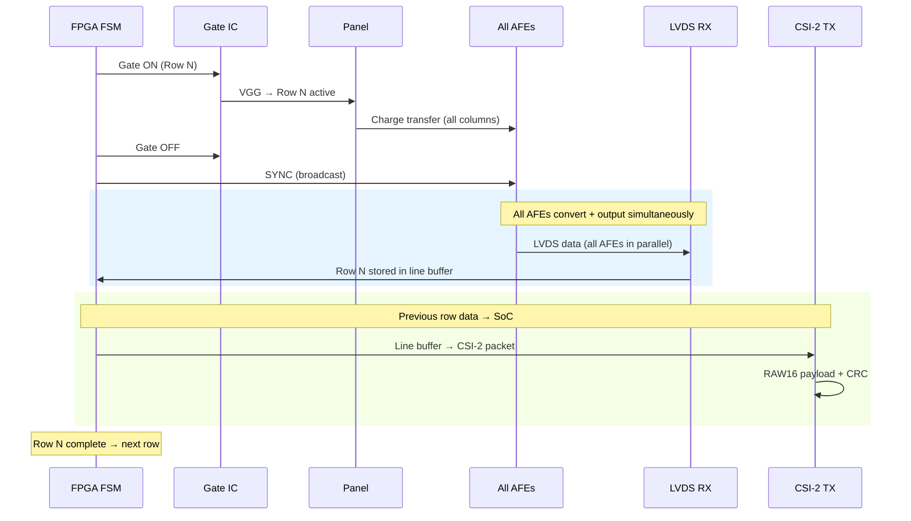
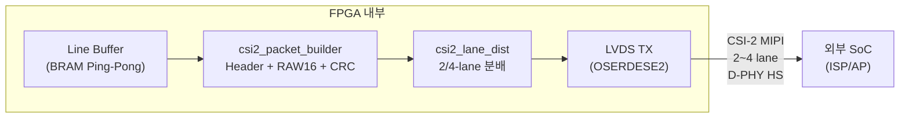
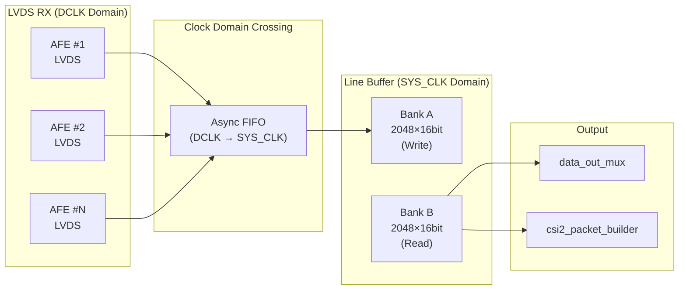
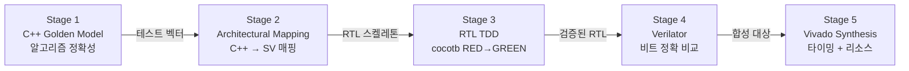

# panel-operation

FPGA-based X-ray Flat Panel Detector (FPD) Control System

a-Si TFT 기반 X-ray Flat Panel Detector의 FPGA 구동 제어 시스템.
3종의 패널, 2종의 Gate IC, 3종의 AFE/ROIC를 조합한 7가지 하드웨어 조합(C1-C7)을 통합 지원하며,
최대 24개 AFE를 Artix-7 35T에서 구현합니다.

**데이터 출력**: CSI-2 MIPI TX (2~4 lane)를 통해 외부 SoC로 고속 전송 (primary).
MCU는 제어/설정 전용 (legacy).

---

## System Architecture

### 전체 시스템 블록도



### Panel - Gate IC - ROIC - FPGA 연결 구조



### 데이터 수집 시퀀스 (1 Row)



---

## Data Output Architecture

### CSI-2 MIPI TX (Primary Output)

Artix-7 35T에서 CSI-2 MIPI TX D-PHY 소프트 구현은 **이미 검증 완료**되어 운용 중.
OSERDESE2 기반 직렬화 + LVDS TX로 D-PHY HS 모드를 구현하며, 외부 직렬화 IC가 불필요합니다.



#### 데이터 경로

| 단계 | 모듈 | 기능 |
|------|------|------|
| 1 | `line_buf_ram` | Ping-pong BRAM에서 완료된 라인 데이터 읽기 |
| 2 | `csi2_packet_builder` | CSI-2 패킷 조립: Short Packet (FS/FE) + Long Packet (Header + RAW16 Payload + CRC-16) |
| 3 | `csi2_lane_dist` | 바이트 인터리빙으로 2/4-lane 분배 (Lane 0 = byte[0,4,8...], Lane 1 = byte[1,5,9...]) |
| 4 | LVDS TX (OSERDESE2) | D-PHY HS 모드 직렬 전송 |

#### CSI-2 패킷 구조

- **Short Packet**: Frame Start (FS, DT=0x00), Frame End (FE, DT=0x01)
- **Long Packet**: Data Identifier (DI) + Word Count (WC) + ECC + RAW16 Payload + CRC-16
- **Data Type**: 0x2E (RAW16)
- **Virtual Channel**: 0 (단일 카메라)

#### 대역폭 구성

| 패널 | 해상도 | 프레임 크기 (16-bit) | 30fps 데이터율 | CSI-2 구성 |
|------|--------|---------------------|---------------|-----------|
| C1-C5 (17") | 2048x2048 | 8 MB | 240 MB/s | 2-lane @ 1.5 Gbps |
| C6-C7 (43cm) | 3072x3072 | 18.9 MB | 567 MB/s | 4-lane @ 1.5 Gbps |

### MCU Interface (Legacy)

MCU 인터페이스는 제어/설정 및 소량 데이터 전송 용도로 유지됩니다.

- `data_out_mux`: 다중 AFE 라인 데이터 → 순차 버스 정렬
- `mcu_data_if`: 16-bit 병렬 데이터 출력 + LINE_RDY IRQ

---

## Line Buffer Architecture

### Ping-Pong BRAM 구조

라인 버퍼는 LVDS RX (DCLK 도메인)에서 수신한 데이터를 SYS_CLK 도메인으로 전달하며,
CSI-2 TX와 MCU 출력 모두에 데이터를 공급합니다.



### 동작 원리

1. **Write Phase**: LVDS RX가 현재 행의 AFE 데이터를 Bank A에 순차 기록
2. **Read Phase**: 이전 행의 Bank B 데이터를 CSI-2 TX (primary) 및 MCU (legacy)로 전송
3. **Bank Swap**: 라인 완료 시 Bank A ↔ Bank B 자동 전환 (1 SYS_CLK 이내)

### Clock Domain Crossing

| 소스 | 대상 | 방식 |
|------|------|------|
| DCLK (AFE 내부 생성) | SYS_CLK (100 MHz) | Dual-clock BRAM 또는 Async FIFO |
| FIFO depth | ≥16 words per AFE group | Overflow 방지 |

### BRAM 사용량

| 용도 | BRAM36K | 비고 |
|------|---------|------|
| Line buffer (ping-pong) | 4 | 2048x16bit x 2 banks |
| LVDS async FIFO (CDC) | 2-4 | Per AFE group |
| **v1 합계** | **~6-8** | **50개 중 사용** |
| 잔여 (v2 확장용) | 42-44 | |

### 다중 AFE 데이터 정렬

`data_out_mux`가 N개 AFE의 256ch 데이터를 픽셀 순서로 재정렬:

- AFE #0: pixel[0..255], AFE #1: pixel[256..511], ..., AFE #N: pixel[(N-1)*256 .. N*256-1]
- C1-C5 (8 AFE): 2048 pixels/line
- C6-C7 (12 AFE): 3072 pixels/line

---

## SW-First Verification

**SPEC 문서**: [`.moai/specs/SPEC-FPD-SIM-001/`](.moai/specs/SPEC-FPD-SIM-001/) — **v1.2.0** (52개 EARS 요구사항, 47개 수용기준, 7-Phase 구현 계획)

**개정 요청서**: [ECR-001](.moai/specs/SPEC-FPD-SIM-001/ECR-001.md) — v1.1.0→v1.2.0 SW Simulation 보강 근거

**리뷰 문서**: [구현 코드 리뷰 v8](docs/review/review-claude.md) | [Copilot 리뷰 v2](review-copilot.md) | [테스트 검증 리포트](docs/review/test-verification-report.md) | [교차검증 v1](docs/review/CROSS-VERIFICATION-REPORT.md)

| 리뷰 단계 | 결과 |
|-----------|------|
| 1차 품질 리뷰 (v1.0.0) | MAJOR 3건 + MINOR 4건 → 모두 수정 |
| 교차검증 (v1.0.0) | HIGH 4 + MEDIUM 5 + LOW 4건 → 모두 수정 |
| 딥싱크 교차검증 (v1.1.0) | 63건 발견 → SPEC v1.1.0 반영 |
| 교차검증 v2→v3 (RTL 구현) | 46건 중 17건 FIXED (37%), 잔여 35건 |
| SPEC v1.2.0 보강 개정 | +12 요구사항, +13 수용기준, +1 Phase (ECR-001) |
| 구현 코드 리뷰 v6 | CRITICAL 6건 발견, R-SIM 25/52 IMPL |
| **v7.1 CRITICAL 전수 해결** | **RTL 4파일 + 골든 모델 10개 신규 + 테스트 확장** |
| **v8 교차검증 (최신)** | **RTL/모델/테스트 코드 대조 완료, 수치 보정 반영** |
| **빌드 + 테스트 검증** | **MSVC 19.40 — 0 에러, 0 경고, 13/13 PASS (100%)** |

**빌드 + 테스트 검증 결과** ([상세 리포트](docs/review/test-verification-report.md)):

| 지표 | 결과 |
|------|------|
| 빌드 (MSVC 19.40 /W4) | **0 에러, 0 경고** |
| 단위 테스트 (CTest) | **13/13 PASS (100%)**, 0.47초 |
| 검증 중 결함 발견 | 2건 (test_panel_fsm, test_radiog_model 크래시) → **즉시 수정** |
| 정적 분석 | raw new/delete 0건, C-style cast 0건, 멤버 초기화 205건 전수 |
| 동적 분석 (ASan) | VS IDE 실행 권장 (간접 검증 완료) |

**v8 코드 리뷰 현황 (교차검증 완료):**

| 지표 | v6 현황 | v8 현황 (교차검증) | 목표 |
|------|---------|---------------------|------|
| 요구사항 구현율 | 25/52 (48%) | **31/52 (60%)** | 100% |
| 수용기준 실PASS | 0/47 (0%) | **~4/47 (9%)** | 47/47 |
| 기능 커버리지 | ~68% | **~72%** | 80% |
| 골든 모델 | 23/30 (71%) | **30/30 (87%)** | 100% |
| C++ 테스트 | 13개 375 LOC, ~25 assert | **13개 579 LOC, 73 assert** | 1,800 LOC |
| cocotb 테스트 | 14개 208 LOC | **14개+infra 478 LOC, 17 assert** | 3,400 LOC |
| CRITICAL | **6건** | **0건 (전수 해결)** | 0 |
| HIGH | 8건 | **4건** | 0 |

**CRITICAL 6건 전수 해결:**

| ID | 문제 | 해결 내용 | 교차검증 |
|----|------|-----------|----------|
| CR-001 | Settle time 미구현 | GateNv1047Model bbm_count 구현 | RTL L37, 모델 L33-42 확인 |
| CR-002 | 듀얼 타임아웃 미분리 | ProtMonModel 5s/30s 분기 | 모델 L22-28 확인 |
| CR-003 | NV1047 BBM 미구현 | bbm_count + safe_bbm_gap + OE 제어 | RTL L51-55,114 확인 |
| CR-004 | NT39565D dual-STV 미구현 | STV1/STV2 토글 + 6칩 cascade | RTL L59-64 확인 |
| CR-005 | TLINE_MIN 검증 부재 | combo_min_tline + tline_clamped 플래그 | RTL L112-185 확인 |
| CR-006 | CSI-2 ECC RTL 미구현 | csi2_ecc() MIPI Annex A Hamming(7,4) | RTL L29-52 확인 |

**v1.2.0 SPEC 변경 (v1.1.0 대비):**
- 요구사항 40→52건: combo 검증, 핸드셰이크, settle, multi-AFE, gate 모델, CIC, v2-prep
- 수용기준 34→47건 + 엣지케이스 5→8건
- Phase 6→7 (Phase 7: v2-Prep Models 신설)
- 리스크 6→8건 (타이밍 발산, multi-AFE 성능)
- 구현 규모: ~85→~105 파일, ~10,400→~13,500 LOC

### 5단계 검증 파이프라인



### C++ → RTL 매핑 규칙

| C++ Construct | SystemVerilog | Notes |
|---------------|---------------|-------|
| `class Model` | `module` | 1:1 매핑 |
| `uint16_t member` | `logic [15:0] reg` | always_ff 레지스터 |
| `step() { if(rst)... }` | `always_ff @(posedge clk or posedge rst)` | 비동기 리셋 |
| `enum class State` | `typedef enum logic [N:0]` | FSM 상태 |
| `std::array<T,N>` (N>64) | `logic [W:0] mem [0:N-1]` | BRAM inferred |
| `std::queue<T>` | Async FIFO (dual-clock BRAM) | CDC FIFO |

### TDD 개발 사이클 (Testbench-First)

1. C++ 골든 모델 작성 (알고리즘 정확성 확인)
2. cocotb 테스트벤치 작성 (expected behavior 정의)
3. RTL 스켈레톤 작성 (인터페이스만)
4. cocotb 실행 → **FAIL (Red)**
5. RTL 구현
6. cocotb 실행 → **PASS (Green)**
7. RTL 리팩토링 (Green 유지)
8. Verilator로 C++ 골든 모델 vs RTL 비트 비교

### 도구 스택

| Tool | Role | License |
|------|------|---------|
| **C++17 (gcc/MSVC)** | 골든 모델: AFE 타이밍, Gate 시퀀스, FSM, CSI-2 TX | Free |
| **GoogleTest** | C++ 골든 모델 단위 테스트 | Open-source |
| **Verilator** | RTL → C++ 변환, DPI-C 사이클 정확 비교 (10~50x faster) | Open-source |
| **cocotb** | Python 테스트벤치, 파일 기반 테스트 벡터 (UVM 불필요) | Open-source |
| **Vivado xsim** | Xilinx 프리미티브 검증, 합성 후 시뮬레이션 | Free (Vivado) |
| **CMake >= 3.20** | 크로스 플랫폼 빌드 (Windows MSVC + Linux GCC) | Open-source |

### C++ Golden Model 클래스 계층

```
GoldenModelBase (추상 기반: reset/step/compare)
├── SpiSlaveModel          SPEC-001: SPI Mode 0/3, 32-register R/W
├── RegBankModel           SPEC-001: 32x16-bit registers, uint16 정렬, TLINE_MIN 클램핑 ★
├── ClkRstModel            SPEC-001: MMCM 클럭 + 2-FF reset sync
├── PanelFsmModel          SPEC-002: 12-state FSM, settle 상태, radiography 타임아웃 ★
├── GateNv1047Model        SPEC-003: SD1/SD2 직렬, BBM 갭 타이밍, OE 제어 ★ NEW
├── GateNt39565dModel      SPEC-004: Dual-STV 토글, 좌우 뱅크, 6칩 cascade ★ NEW
├── AfeAd711xxModel        SPEC-005: AD71124/AD71143 (IFS 5/6비트 검증)
├── AfeAfe2256Model        SPEC-006: MCLK, CIC 기본, 파이프라인 1행 지연
├── AfeSpiMasterModel      SPEC-005: CS 제어, 전송 상태, 데이지체인 ★ NEW
├── LvdsRxModel            SPEC-007: ADI/TI LVDS 역직렬화, bitslip ★ NEW
├── LineBufModel           SPEC-007: Ping-pong BRAM + CDC queue + auto-increment
├── DataOutMuxModel        SPEC-007: 라인 시작 신호, 픽셀 출력 ★ NEW
├── McuDataIfModel         SPEC-007: IRQ 생성, 라인 종료 ★ NEW
├── Csi2PacketModel        SPEC-007: FS/FE + RAW16 + CRC-16 + ECC
├── Csi2LaneDistModel      SPEC-007: 2/4-lane byte interleaving
├── ProtMonModel           SPEC-008: 5s/30s 듀얼 타임아웃, 과전압/과온도 ★
├── PowerSeqModel          SPEC-008: VGL→VGH 시퀀스, 8-state FSM
├── EmergencyShutdownModel SPEC-008: 과전압/과온도/PLL 감지 + 긴급 차단
├── PanelIntegModel        SPEC-002: 적분 시간 실행 ★ NEW
├── PanelResetModel        SPEC-002: 단일행/전체 리셋 시퀀스 ★ NEW
├── RadiogModel            SPEC-010: 다크 프레임, X-ray 핸드셰이크 ★ NEW
├── TestVectorIO           Core: hex/binary 벡터 직렬화 ★ NEW
└── FoundationConstants    Core: ComboMinTLine, ComboDefaultNCols, IsReadOnly ★

★ = v7~v8에서 신규 추가 또는 주요 개선

주요 모델 구현 세부사항:
- GateNv1047Model: BBM 카운터 (cfg_gate_settle 사이클 대기), safe_bbm_gap (최소 1사이클)
- GateNt39565dModel: STV1/STV2 홀짝 행 토글, 좌우 뱅크, chip_phase=row/541 (3248/6=541)
- RegBankModel: uint16 정렬, combo별 TLINE_MIN 클램핑, tline_clamped sticky flag
- ProtMonModel: radiography_mode 분기 (5s kDefaultTimeout / 30s kRadiogTimeout)
- Csi2PacketModel: CRC-16 CCITT (0x1021) + ECC (Annex A Hamming(7,4) SECDED), DT=0x2E, VC=0
- EmergencyShutdownModel: 과전압/과온도/PLL 장애 감지 + 긴급 차단

**네이밍 규칙**: C++ PascalCase ↔ RTL snake_case (예: Csi2PacketModel ↔ csi2_packet_builder)
```

### Xilinx Primitive Handling (Verilator 호환)

Verilator는 Xilinx 프리미티브를 직접 지원하지 않으므로 behavioral wrapper를 사용:

| Module | Primitives | Verilator | xsim |
|--------|-----------|-----------|------|
| clk_rst_mgr | MMCME2_ADV | Behavioral (클럭 분주/체배) | 실제 MMCM |
| line_data_rx | IBUFDS, ISERDESE2, IDELAYE2 | Behavioral (DDR→8-bit) | 실제 프리미티브 |
| CSI-2 TX | OSERDESE2 | Behavioral (8-bit→DDR) | 실제 프리미티브 |

### sim/ 디렉토리 구조

```
sim/
├── golden_models/
│   ├── core/                        Base framework
│   │   ├── GoldenModelBase.h/cpp    Abstract base: reset/step/compare
│   │   ├── SignalTypes.h            Bit-accurate types (uint16_t, packed structs)
│   │   ├── ClockDomain.h/cpp        Multi-clock domain modeling
│   │   ├── TestVectorIO.h/cpp       Test vector read/write (hex/binary)
│   │   ├── CRC16.h/cpp              CRC-16 CCITT (MIPI CSI-2)
│   │   └── ECC.h/cpp                MIPI CSI-2 ECC calculator
│   ├── models/                      Per-module golden models (20 files)
│   │   ├── SpiSlaveModel.h/cpp      SPEC-001
│   │   ├── PanelFsmModel.h/cpp      SPEC-002
│   │   ├── GateNv1047Model.h/cpp    SPEC-003
│   │   ├── AfeAd711xxModel.h/cpp    SPEC-005
│   │   ├── Csi2PacketModel.h/cpp    SPEC-007
│   │   └── ...                      (14 models total)
│   ├── generators/                  Test vector generators
│   │   ├── gen_spi_vectors.cpp      SPEC-001
│   │   ├── gen_fsm_vectors.cpp      SPEC-002
│   │   ├── gen_csi2_vectors.cpp     SPEC-007
│   │   └── ...
│   └── test_vectors/                Generated output (hex/bin per SPEC)
├── cocotb_tests/                    Python testbenches (14 files)
│   ├── conftest.py                  Shared fixtures + vector loader
│   ├── test_spi_slave.py            SPEC-001
│   ├── test_panel_fsm.py            SPEC-002
│   ├── test_csi2_tx.py              SPEC-007
│   └── ...
├── verilator/                       Cycle-accurate RTL comparison (scaffold)
│   ├── sim_main.cpp                 Verilator top-level driver (scaffold)
│   ├── golden_compare.h/cpp         RunGoldenCompare() 프레임워크 (구현됨)
│   ├── compare_spi.cpp              SPI 모델 vs RTL 비교기 (RTL 미바인딩)
│   ├── compare_fsm.cpp              FSM 모델 vs RTL 비교기 (RTL 미바인딩)
│   ├── compare_csi2.cpp             CSI-2 모델 vs RTL 비교기 (RTL 미바인딩)
│   ├── waveform_dump.h/cpp          파형 덤프 (stub)
│   ├── xilinx_behav/                Xilinx primitive behavioral wrappers
│   │   ├── MMCME2_ADV_behav.sv
│   │   ├── ISERDESE2_behav.sv
│   │   ├── IDELAYE2_behav.sv
│   │   ├── IBUFDS_behav.sv
│   │   └── OSERDESE2_behav.sv
│   └── Makefile                     Placeholder (Verilator 빌드 미구성)
├── tests/                           C++ unit tests (GoogleTest)
│   ├── test_crc16.cpp
│   ├── test_ecc.cpp
│   ├── test_spi_model.cpp
│   └── ...
└── CMakeLists.txt                   Top-level build (golden_models + tests + generators)
```

### 현재 규모 / 예상 규모

| Category | 현재 Files | 현재 LOC | 목표 LOC |
|----------|-----------|---------|---------|
| Core framework | 12 | ~900 | ~800 |
| Golden models (30종) | 60 | ~4,200 | ~4,000 |
| Vector generators | 6 | ~250 | ~600 |
| C++ unit tests (14개) | 14 | **638** | ~1,800 |
| cocotb tests (14+2) | 16 | **478** | ~3,400 |
| Verilator framework | 8 | ~200 (scaffold+framework) | ~500 |
| Verilator wrappers | 5 | ~200 | ~500 |
| **Total** | **~121** | **~6,866** | **~11,600** |

---

## Hardware Combinations

| ID | Panel | Gate IC | AFE/ROIC | 용도 | CSI-2 구성 |
|----|-------|---------|----------|------|-----------|
| C1 | R1717 (17x17") | NV1047 | AD71124 | 표준 정지상 | 2-lane |
| C2 | R1717 | NV1047 | AD71143 | 저전력 / 모바일 | 2-lane |
| C3 | R1717 | NV1047 | AFE2256 | 고화질 (저노이즈, CIC) | 2-lane |
| C4 | R1714 (17x14") | NV1047 | AD71124 | 비정방형 | 2-lane |
| C5 | R1714 | NV1047 | AFE2256 | 고화질 17x14 | 2-lane |
| C6 | X239AW1-102 (43x43cm) | NT39565D x6 | AD71124 x12 | 대형, 다중 AFE | 4-lane |
| C7 | X239AW1-102 | NT39565D x6 | AFE2256 x12 | 대형, 고화질 | 4-lane |

---

## Target Device

| Spec | Value |
|------|-------|
| FPGA | xc7a35tfgg484-1 |
| Family | Xilinx Artix-7 35T |
| Package | FGG484 |
| Speed Grade | -1 |
| Logic Cells | 33,280 |
| DSP48E1 | 90 |
| BRAM36K | 50 (1,800 Kb) |
| I/O Pins | 250 |
| MMCM | 5 |
| AFE Support | Max 24 chips (direct LVDS, 3 pairs/AFE = 6 pins) |
| LVDS (24 AFE) | 72 diff pairs = 144 pins (of 250 available) |
| CSI-2 TX | D-PHY soft-IP (OSERDESE2), 2~4 lane, 검증 완료 |
| Toolchain | Vivado 2025.2 |

---

## FPGA Module Hierarchy

### v1 RTL Directory Structure (BRAM only)

```
rtl/
├── packages/                      Global definitions
│   ├── fpd_types_pkg.sv           FSM states, enums, type definitions
│   └── fpd_params_pkg.sv          Configurable system parameters
│
├── common/                        Shared FPGA infrastructure
│   ├── spi_slave_if.sv            MCU SPI slave (register R/W)
│   ├── clk_rst_mgr.sv            Clock generation (MMCM) + reset sync
│   ├── reg_bank.sv                32-register file (0x00-0x1F)
│   ├── data_out_mux.sv            Line data → MCU bus alignment
│   ├── mcu_data_if.sv             MCU data transfer + IRQ (legacy)
│   ├── csi2_packet_builder.sv     CSI-2 packet assembly (FS/FE + RAW16 + CRC)
│   ├── csi2_lane_dist.sv          CSI-2 2/4-lane byte interleaving
│   ├── prot_mon.sv                Over-exposure timeout, error flags
│   ├── power_sequencer.sv         Power mode M0-M5, VGL-before-VGH
│   └── emergency_shutdown.sv      Over-voltage/temp/PLL detection
│
├── panel/                         Panel driving control
│   ├── panel_ctrl_fsm.sv          Main FSM (12 states incl. v1-extended, 5 modes)
│   ├── panel_reset_ctrl.sv        Reset sequence + dummy scans
│   └── panel_integ_ctrl.sv        Integration timing + X-ray handshake
│
├── gate/                          Gate IC drivers
│   ├── gate_nv1047.sv             NV1047 driver (C1-C5): SD/CLK/OE
│   ├── gate_nt39565d.sv           NT39565D driver (C6-C7): dual STV/CPV
│   └── row_scan_eng.sv            Row counter + Gate ON/OFF timing
│
├── roic/                          AFE/ROIC controllers
│   ├── afe_ad711xx.sv             AD71124/AD71143 (ACLK, SYNC, SPI)
│   ├── afe_afe2256.sv             AFE2256 (MCLK, CIC, TP_SEL)
│   ├── afe_spi_master.sv          SPI master (daisy-chain, max 24 AFE)
│   ├── line_data_rx.sv            LVDS receiver (per AFE, ISERDESE2)
│   └── line_buf_ram.sv            BRAM ping-pong line buffer
│
└── top/                           Top-level per combination
    ├── detector_core.sv           전체 서브모듈 인스턴스화 (551줄)
    ├── fpga_top_c1.sv             C1: NV1047 + AD71124 (reference)
    ├── fpga_top_c3.sv             C3: NV1047 + AFE2256 (고화질)
    └── fpga_top_c6.sv             C6: NT39565D ×6 + AD71124 ×12 (대형)
```

**v1 RTL 현황**: 27개 SystemVerilog 모듈 (packages 2 + common 10 + panel 3 + gate 3 + roic 5 + top 4) | FSM 12-state (v1-extended) + Combo별 TLINE/NCOLS 검증 | **CRITICAL 0건** (ECC, BBM, dual-STV, TLINE_MIN, 듀얼 타임아웃 전수 구현)

### sim/ Directory Structure (SW-First Verification — 구현됨)

```
sim/
├── golden_models/
│   ├── core/                        Base framework (6 files)
│   │   ├── GoldenModelBase.h/cpp    Abstract base: reset/step/compare
│   │   ├── SignalTypes.h            Bit-accurate types + SignalValue variant
│   │   ├── ClockDomain.h/cpp        Multi-clock domain modeling
│   │   ├── TestVectorIO.h/cpp       Test vector read/write (hex/binary)
│   │   ├── CRC16.h/cpp              CRC-16 CCITT (MIPI CSI-2)
│   │   └── ECC.h/cpp                MIPI CSI-2 ECC calculator
│   ├── models/                      Per-module golden models (30 models, 60 files)
│   │   ├── SpiSlaveModel.h/cpp      SPEC-001: SPI Mode 0/3
│   │   ├── RegBankModel.h/cpp       SPEC-001: 32×16-bit, TLINE_MIN 클램핑 ★
│   │   ├── ClkRstModel.h/cpp        SPEC-001: MMCM + 2-FF reset sync
│   │   ├── PanelFsmModel.h/cpp      SPEC-002: 12-state FSM, settle, radiog ★
│   │   ├── PanelIntegModel.h/cpp    SPEC-002: 적분 시간 NEW
│   │   ├── PanelResetModel.h/cpp    SPEC-002: 리셋 시퀀스 NEW
│   │   ├── RowScanModel.h/cpp       SPEC-003: Row counter + timing
│   │   ├── GateNv1047Model.h/cpp    SPEC-003: BBM 갭 타이밍 NEW
│   │   ├── GateNt39565dModel.h/cpp  SPEC-004: Dual-STV, 6칩 NEW
│   │   ├── AfeAd711xxModel.h/cpp    SPEC-005: AD71124/AD71143 ★
│   │   ├── AfeAfe2256Model.h/cpp    SPEC-006: MCLK, CIC, pipeline ★
│   │   ├── AfeSpiMasterModel.h/cpp  SPEC-005: SPI 데이지체인 NEW
│   │   ├── LvdsRxModel.h/cpp        SPEC-007: LVDS 역직렬화 NEW
│   │   ├── LineBufModel.h/cpp       SPEC-007: Ping-pong + CDC ★
│   │   ├── DataOutMuxModel.h/cpp    SPEC-007: 픽셀 출력 NEW
│   │   ├── McuDataIfModel.h/cpp     SPEC-007: IRQ + 라인 종료 NEW
│   │   ├── Csi2PacketModel.h/cpp    SPEC-007: FS/FE + RAW16 + CRC + ECC
│   │   ├── Csi2LaneDistModel.h/cpp  SPEC-007: 2/4-lane interleaving
│   │   ├── RadiogModel.h/cpp        SPEC-010: X-ray 핸드셰이크 NEW
│   │   ├── ProtMonModel.h/cpp       SPEC-008: 5s/30s 듀얼 타임아웃 ★
│   │   ├── PowerSeqModel.h/cpp      SPEC-008: VGL→VGH 시퀀스
│   │   ├── EmergencyShutdownModel.h/cpp  SPEC-008: 과전압/과온도
│   │   └── FoundationConstants.h    ComboMinTLine, ComboDefaultNCols ★
│   └── generators/                  Test vector generators (6 files)
│       ├── gen_spi_vectors.cpp      SPEC-001 벡터 생성
│       ├── gen_fsm_vectors.cpp      SPEC-002 FSM 벡터 NEW
│       ├── gen_gate_vectors.cpp     SPEC-003/004 Gate 벡터 NEW
│       ├── gen_afe_vectors.cpp      SPEC-005/006 AFE 벡터 NEW
│       ├── gen_csi2_vectors.cpp     SPEC-007 CSI-2 벡터 NEW
│       └── gen_safety_vectors.cpp   SPEC-008 Safety 벡터 NEW
├── cocotb_tests/                    Python testbenches (14 + infra 2, 478 LOC total)
│   ├── conftest.py                  Shared fixtures + start_clock + VECTOR_ROOT
│   ├── vector_utils.py              hex 벡터 로드 + RTL 비교 프레임워크 NEW
│   ├── test_spi_slave.py            SPEC-001 (스모크)
│   ├── test_reg_bank.py             SPEC-001 (벡터 기반)
│   ├── test_clk_rst.py              SPEC-001 (기능: PLL lock)
│   ├── test_panel_fsm.py            SPEC-002 (벡터 기반)
│   ├── test_gate_nv1047.py          SPEC-003 (기능: OE, BBM) ★
│   ├── test_gate_nt39565d.py        SPEC-004 (스모크)
│   ├── test_afe_ad711xx.py          SPEC-005 (기능: config→ready)
│   ├── test_afe_afe2256.py          SPEC-006 (기능: config_done) ★
│   ├── test_lvds_rx.py              SPEC-007 (스모크) NEW
│   ├── test_line_buf.py             SPEC-007 (스모크)
│   ├── test_csi2_tx.py              SPEC-007 (스모크)
│   ├── test_safety.py               SPEC-008 (스모크)
│   ├── test_integration.py          SPEC-009 (벡터 기반) NEW
│   └── test_radiography.py          SPEC-010 (벡터 기반) NEW
├── tests/                           C++ unit tests (GoogleTest, 14 files, 638 LOC, 76 assert)
│   ├── test_panel_aux_models.cpp    리셋/적분/듀얼타임아웃/prot_mon (128 LOC, 13 assert) NEW
│   ├── test_reg_bank.cpp            전 레지스터 RW + TLINE_MIN + NCOLS (73 LOC, 18 assert) ★
│   ├── test_prot_mon.cpp            듀얼 타임아웃 독립 검증 (59 LOC, 3 assert) NEW
│   ├── test_radiog_model.cpp        다크 프레임 + 평균화 (59 LOC, 5 assert)
│   ├── test_afe_models.cpp          AD711xx IFS + AFE2256 + SPI + LVDS (47 LOC) NEW
│   ├── test_data_path_models.cpp    LineBuf + DataOutMux + McuDataIf (47 LOC) NEW
│   ├── test_panel_fsm.cpp           settle 상태 진입 검증 (46 LOC) ★
│   ├── test_vector_io.cpp           hex/binary 벡터 round-trip (37 LOC) NEW
│   ├── test_gate_models.cpp         NV1047 BBM + NT39565D STV (34 LOC) NEW
│   ├── test_ecc.cpp                 CSI-2 ECC parity (30 LOC)
│   ├── test_csi2_model.cpp          ECC 헤더 검증 (21 LOC) ★
│   ├── test_crc16.cpp               CRC-16 CCITT (20 LOC)
│   ├── test_spi_model.cpp           SPI slave (19 LOC)
│   └── test_clk_rst.cpp             Clock/reset (18 LOC)
└── CMakeLists.txt                   Top-level build (golden_models + tests + generators)
```

**sim/ 현황**: ~121개 파일 (C++ 골든 모델 30종, GoogleTest 14개 638 LOC 76 assert, cocotb 14+2개 478 LOC, 벡터 생성기 6개, Verilator 프레임워크 8개)

상세 사양: [SPEC-FPD-SIM-001](.moai/specs/SPEC-FPD-SIM-001/plan.md)

### v2 추가 Modules (외부 메모리 확장, 별도 구현)

```
rtl/
├── extmem/                        External memory interface
│   ├── ext_mem_if.sv              SRAM/DDR MIG interface
│   └── frame_buffer_ctrl.sv       Frame buffer management
│
└── calibration/                   Real-time correction pipeline
    ├── offset_subtractor.sv       Offset subtraction (ext mem)
    ├── gain_multiplier.sv         Gain normalization (ext mem)
    ├── defect_replacer.sv         Defect pixel interpolation
    ├── lag_corrector_lti.sv       LTI lag correction (ext mem state)
    └── forward_bias_ctrl.sv       Forward bias control
```

---

## FSM Operating Modes

| Value | Mode | Description |
|-------|------|-------------|
| 000 | STATIC | 단일 프레임 획득 |
| 001 | CONTINUOUS | 자동 반복 (형광투시) |
| 010 | TRIGGERED | X-ray 외부 트리거 대기 |
| 011 | DARK_FRAME | Gate off, AFE 리드아웃만 (캘리브레이션) — FSM 상태가 아닌 모드 |
| 100 | RESET_ONLY | 패널 리셋 전용 |

**Note**: DARK_FRAME은 FSM 상태가 아닌 동작 모드이다. SCAN_LINE 상태에서 GATE_EN=0을 유지하여 Gate IC 비활성 상태에서 AFE 리드아웃만 수행한다 (offset 캘리브레이션용).

---

## 신호 흐름 요약

```
MCU ──SPI──▶ FPGA ──SD/CLK/OE──▶ Gate IC ──VGG/VEE──▶ Panel (Row Select)
                                                            │
                                                     Charge Signal
                                                            ▼
                 FPGA ◀──LVDS (3 pairs/AFE × 24 = 72 pairs)── AFE ◀── Panel (Column Out)
                  │                       ▲
                  │                       │
                  └──SPI/SYNC/ACLK────────┘  (Broadcast to all AFEs)

                  │ Line Buffer (Ping-Pong BRAM)
                  │
           ┌──────┴──────────┐
           ▼                 ▼
  CSI-2 MIPI TX        data_out_mux
  (Primary)            (Legacy MCU)
           │                 │
           ▼                 ▼
  외부 SoC (ISP/AP)     MCU (제어 전용)
           │
    SW 보정 (Offset,
    Gain, Defect, Lag)
```

---

## Implementation Plan

### v1: BRAM Only (외부 메모리 없음)

핵심 구동 + 데이터 수집. 보정은 MCU/PC 소프트웨어에서 처리.
각 SPEC에 Acceptance Criteria, Module Mapping, Timing Constraints, Register Map, Test Plan, Dependencies 포함.

| SPEC | Title | Modules | Dependencies |
|------|-------|---------|--------------|
| SPEC-FPD-001 | Foundation: SPI + Register + Clock | spi_slave_if, reg_bank, clk_rst_mgr, packages | None |
| SPEC-FPD-002 | Panel Control FSM (7-state, 5-mode) | panel_ctrl_fsm, panel_reset_ctrl, panel_integ_ctrl | 001 |
| SPEC-FPD-003 | Gate NV1047 Driver + Row Scan Engine | gate_nv1047, row_scan_eng | 001 |
| SPEC-FPD-004 | Gate NT39565D Driver (large panel) | gate_nt39565d | 001, 003 |
| SPEC-FPD-005 | AFE AD711xx Controller (ACLK/SYNC) | afe_ad711xx, afe_spi_master | 001 |
| SPEC-FPD-006 | AFE2256 Controller (MCLK/CIC/SYNC) | afe_afe2256 | 001, 005 |
| SPEC-FPD-007 | LVDS Receiver + Line Buffer + CSI-2 TX Output | line_data_rx, line_buf_ram, data_out_mux, mcu_data_if, csi2_packet_builder, csi2_lane_dist | 005 or 006 |
| SPEC-FPD-008 | Safety: Protection + Emergency + Power | prot_mon, emergency_shutdown, power_sequencer | 001 |
| SPEC-FPD-009 | Integration: fpga_top C1/C3/C6 | fpga_top_c1, fpga_top_c3, fpga_top_c6 | 001-008 |
| SPEC-FPD-010 | Radiography Static Mode Extension | panel_ctrl_fsm (확장) | 009 |

| SPEC-FPD-SIM-001 | SW-First Verification Framework | GoldenModelBase, 22 C++ models, cocotb tests, Verilator harness | 각 SPEC 병렬 |

**SPEC 진행 상태:**

| SPEC | Status | 비고 |
|------|--------|------|
| SPEC-FPD-SIM-001 | **v1.2.0** (구현 진행 중) | 52 요구사항, 47 수용기준, 7 Phase, ECR-001 승인 |
| SPEC-FPD-001 ~ 010 | SPEC 미수립 | SIM-001 기반으로 순차 수립 예정 |

**SW Simulation 구현 진척도 (v1.2.0 plan.md 기준):**

| Phase | 범위 | v6 | v8 | 상태 |
|-------|------|-----|-----|------|
| 1. Foundation | Core + SPI + RegBank + ClkRst | 100% | **100%** | COMPLETE |
| 2. FSM + Safety | PanelFSM + Prot + Power | 62% | **75%** | IN_PROGRESS (듀얼 타임아웃 구현) |
| 3. Gate IC | RowScan + NV1047 + NT39565D | 88% | **92%** | IN_PROGRESS (BBM, STV 구현) |
| 4. AFE Controller | AfeSPI + AD711xx + AFE2256 | 70% | **78%** | IN_PROGRESS (SPI 마스터, IFS) |
| 5. Data Path | LVDS + LineBuf + CSI-2 | 67% | **77%** | IN_PROGRESS (ECC, DataOutMux, McuDataIf) |
| 6. Integration | RadiogModel + Verilator | 100% | **100%** | COMPLETE |
| 7. v2-Prep | ForwardBias + Settle + Cal | 0% | 0% | NOT_STARTED |
| **전체** | | **63%** | **72%** | **+9%p** |

**영역별 기능 커버리지 (v8 교차검증 기준):**

| 영역 | v6 | v8 | 변화 |
|------|-----|-----|------|
| Core SPI + 레지스터 | 85% | **95%** | TLINE_MIN, NCOLS, tline_clamped |
| Panel FSM 제어 | 75% | **85%** | settle 상태, radiography 분기 |
| Gate 드라이버 | 80% | **87%** | BBM 갭, dual-STV, 6칩 cascade |
| AFE 제어 | 70% | **80%** | IFS 검증, CIC 기본, SPI 마스터 |
| CSI-2 TX | 75% | **80%** | ECC Hamming(7,4) RTL 구현 |
| 데이터 패스 | 65% | **77%** | DataOutMux, McuDataIf, LVDS RX |
| 안전 모듈 | 70% | **75%** | 듀얼 타임아웃, 노출 카운터 |
| cocotb/Verilator 통합 | 40% | **40%** | Verilator scaffold 유지 |
| **전체** | **~68%** | **~72%** | **+4%p** |

**Implementation Order**: SIM-001 (각 SPEC과 병행) + 001 → (002 + 008 병렬) → (003 + 005 병렬) → (004 + 006 병렬) → 007 → 009 → 010

### v2: 외부 메모리 확장 (v1 완료 후)

외부 SRAM/DDR 추가, FPGA 내 실시간 보정 파이프라인 구현.

| SPEC | Title |
|------|-------|
| SPEC-FPD-011 | External Memory Interface (SRAM/DDR) |
| SPEC-FPD-012 | Offset Subtraction Pipeline |
| SPEC-FPD-013 | Gain Multiplication Pipeline |
| SPEC-FPD-014 | Defect Pixel Replacement |
| SPEC-FPD-015 | LTI Lag Correction |
| SPEC-FPD-016 | Forward Bias Control |
| SPEC-FPD-017 | Frame Buffer + Multi-frame Averaging |
| SPEC-FPD-018 | v2 Integration & Calibration Validation |

상세 계획 (SPEC별 인수 기준, 타이밍, 테스트): [`.moai/project/implementation-plan.md`](.moai/project/implementation-plan.md)

---

## Documentation

| Directory | Content |
|-----------|---------|
| `docs/fpga-design/` | FPGA 설계 사양서 (모듈 아키텍처, 구동 알고리즘, 정지영상, 전원 설정) |
| `docs/research/` | 부품/알고리즘 리서치 (TFT 물리, Gate IC, AFE, 래그 보정, 캘리브레이션, 다중 AFE) |
| `docs/datasheet/` | IC 데이터시트 PDF (AD71124, AD71143, AFE2256, NV1047, NT39565D, 패널) |
| `.moai/project/` | 프로젝트 문서 (product.md, structure.md, tech.md, implementation-plan.md) |
| `.moai/specs/` | SPEC 문서 (EARS 요구사항, 수용기준, 구현 계획, 리서치) |
| `sim/` | SW-First 검증 — C++ 골든 모델 30종, GoogleTest 13개(579 LOC), cocotb 16개(478 LOC), 벡터 생성기 6개 (~100파일) |
| `sim/viewer/` | FPD Simulation Viewer (C# WPF .NET 8) — 12 골든 모델 포팅, 3-Tab GUI, 64 xUnit 테스트 ([사용 가이드](sim/viewer/USER_GUIDE.md)) |
| `docs/review/` | 구현 코드 리뷰 v8 (교차검증) + Copilot 리뷰 v2 + 테스트 검증 리포트 (빌드 0에러, 13/13 PASS) |

### 리서치 문서 목록

| File | Topic |
|------|-------|
| `research_01_asi_tft_physics.md` | a-Si TFT 물리 특성 및 구동 원리 |
| `research_02_gate_ic_control.md` | Gate IC 제어 (NV1047, NT39565D) |
| `research_03_roic_afe_optimal.md` | ROIC/AFE 최적 구동 (AD71124, AD71143, AFE2256) |
| `research_04_drive_sequence_patents.md` | 구동 시퀀스 특허 분석 |
| `research_05_lag_correction.md` | 이미지 래그 보정 알고리즘 |
| `research_06_calibration.md` | 캘리브레이션 (Offset, Gain, Defect) |
| `research_07_multi_afe_advanced.md` | 다중 AFE 고급 구동 (24-chip LVDS 직결) |

---

## Change History

| Date | Summary |
|------|---------|
| 2026-03-19 | 초기 프로젝트 설정 + README + RTL v1 모듈 구조 (22 .sv) |
| 2026-03-19 | SPEC-FPD-SIM-001 v1.0.0 수립 (SW-First 검증 프레임워크) |
| 2026-03-19 | 1차 품질 리뷰 8.0/10, MAJOR 3 + MINOR 4건 수정 |
| 2026-03-19 | 교차검증 일괄 수정 (HIGH 4 + MEDIUM 5 + LOW 4건) |
| 2026-03-20 | research_01 문자 깨짐 복구 |
| 2026-03-21 | 딥싱크 교차검증 — 63건 발견, SPEC v1.1.0 (40 요구사항, 34 수용기준) |
| 2026-03-21 | 아키텍처 보강 (CDC 사양, FCLK, REG_NRESET, 누락 모듈 4건) |
| 2026-03-21 | RTL 구현 보강 (26 .sv, 스켈레톤→구현) + sim/ 골든 모델 프레임워크 (56파일) |
| 2026-03-21 | detector_core.sv 신규 구현 + fpga_top 인스턴스화 (27 .sv) |
| 2026-03-21 | gate_nv1047 SR + CLK 분주, afe SPI 실구현, REG_TINTEG 24비트, data_out_mux cfg_ncols |
| 2026-03-21 | 교차검증 v3 — 46건 중 17건 FIXED (37%), 신규 7건 발견, 잔여 35건 (완성도 ~63%) |
| 2026-03-21 | SPEC v1.2.0 개정 — +12 요구사항, +13 수용기준, Phase 7 신설 (ECR-001) |
| 2026-03-21 | FSM v1-extended 상태 구현 (S1/S3/S5/S7) + PanelFsmModel 타이밍 파라미터화 |
| 2026-03-21 | 구현 코드 리뷰 v4 — R-SIM 27/52 IMPL, AC-SIM 22/47 PASS, 기능 커버리지 68% |
| 2026-03-21 | 구현 코드 리뷰 v5 — 테스트 실검증 기준 적용, AC-SIM 0/47 실PASS (stub 재판정) |
| 2026-03-21 | VS2022 빌드 검증 — MSVC 19.40 /W4: 0 에러 0 경고, CTest 13/13 PASS (100%) |
| 2026-03-21 | test_panel_fsm + test_radiog_model 크래시 수정 (0xc0000409 → PASS) |
| 2026-03-21 | 테스트 검증 리포트(TVR-001) 발행 — 빌드/테스트/정적/동적 분석 종합 |
| 2026-03-23 | 구현 코드 리뷰 v6 — CRITICAL 6건 발견, 3 Sprint 개선 계획 수립 |
| 2026-03-23 | **CRITICAL 6건 전수 해결** — RTL: ECC(csi2_packet_builder), BBM(gate_nv1047), dual-STV(gate_nt39565d), TLINE_MIN(reg_bank) |
| 2026-03-23 | 골든 모델 10개 신규 추가 — GateNv1047, GateNt39565d, RadiogModel, LvdsRx, PanelInteg, PanelReset, AfeSpiMaster, DataOutMux, McuDataIf, TestVectorIO |
| 2026-03-23 | 테스트 대폭 확장 — C++ 375→579 LOC(73 assert), cocotb 208→478 LOC(17 assert), 벡터 생성기 5개 추가 |
| 2026-03-23 | CR-002 듀얼 타임아웃(ProtMonModel 5s/30s) + CR-005 tline_clamped sticky flag 구현 |
| 2026-03-23 | Copilot 리뷰 v2 — Verilator 비운영 확인, 벡터 경로 통일 확인, accept-all 제거 확인 |
| 2026-03-23 | **교차검증 v8** — RTL 4파일 + 골든 모델 8항목 + 테스트 27파일 코드 대조 완료, 수치 보정 반영 |
| 2026-03-25 | **FPD Simulation Viewer** (C# WPF) — 12 골든 모델 C# 포팅, 3-Tab GUI, 64 xUnit 테스트 |
| 2026-03-27 | FPD Simulation Viewer 사용 가이드 작성 + NullRef 버그 수정 |

---

## License

Private / Internal Use
